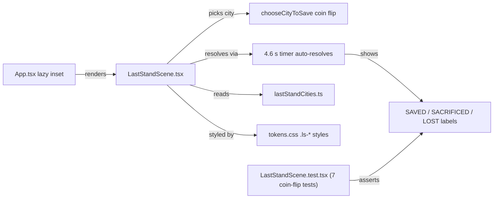
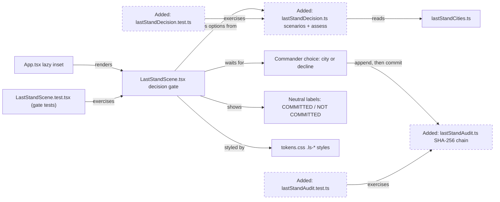
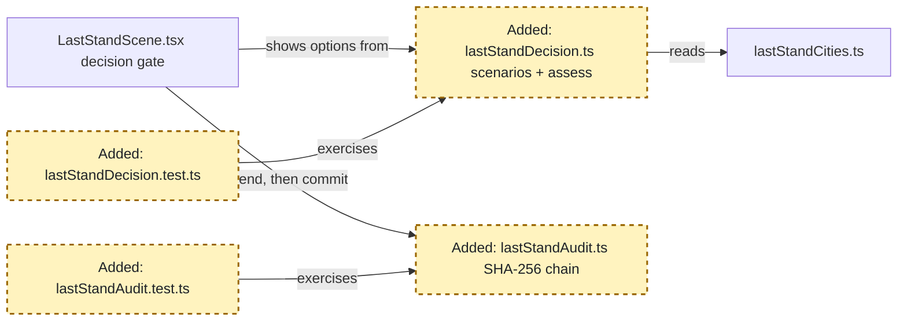
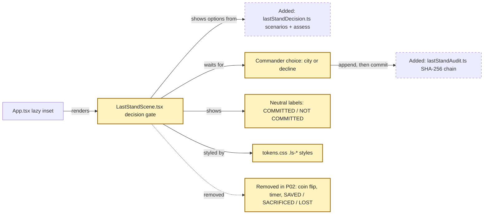
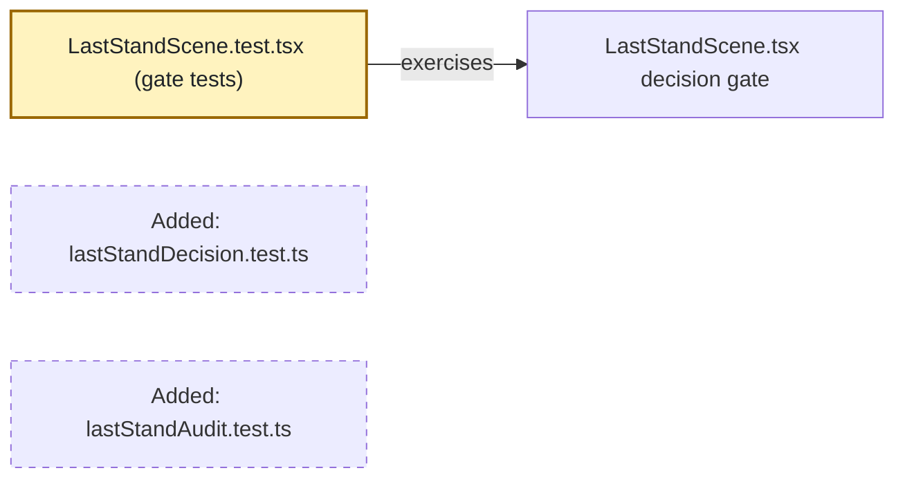

<!-- markdownlint-disable-file -->
# RPI Plan: Single-save decision governance, Story 1 (governed decision gate)

## Task Metadata

* Task ID: single-save-decision-governance
* Task slug: single-save-decision-governance
* Plan date: 2026-10-07

## Executive Summary

* Bottom line: Replace the Last Stand coin flip with a governed decision gate. The scene will show both cities with a harm range and a simulated confidence score that names its basis. It recommends one city or says "No reliable recommendation". Nothing resolves on a timer. The commander must choose a city or decline to the manual procedure. A choice commits only after a SHA-256 hash-chained audit entry is written. The saved, sacrificed and lost wording is removed.
* Why this matters: Today the scene models the RAI plan's central risk (the system decides and no human confirms). After this change, the scene demonstrates the opposite: the human decides, the uncertainty is visible, and every decision is recorded.
* Planning result: Complete and ready for your approval. Three phases, six tasks, all within the Last Stand path. An independent critique found 7 gaps; all are fixed in the plan. The biggest was a contradictory recommendation rule.
* Confidence and uncertainty: High for scope and approach. The research verified the code and baseline. Web Crypto works in Vitest jsdom (probe run during planning). Medium for layout: the inset is 300 by 200 px today and must grow to fit two option cards and the controls.

### What You May Not Know

* **Confidence, identity and the audit log are all simulated.** The score comes from mocked scenarios, the operator ID is a fixed demo value, and the log lives in memory and is lost on reload. These gaps are recorded, not hidden, and the UI labels the score as simulated.
* **RE-RUN changes meaning.** Today it re-rolls a coin. After this change it moves to the next mocked scenario. At least one scenario must make the system decline, so the decline path can be demonstrated.
* **The kaiju "impact" animation goes away.** Showing one city being overrun is the same framing as SACRIFICED. After a commit, only the committed city shows a shield.
* **All seven existing scene tests are replaced.** They check the coin flip and the old labels, so they cannot survive. The city geography tests stay untouched.
* **Overriding the system requires a reason.** Committing against the recommendation, committing a city when the system abstained, or declining a recommendation needs a short reason, written into the audit entry. The user rejected deferring this (PD2): an audit record without the override reason is a signature, not oversight. Declining after an abstention is exempt, because the audit entry already records the abstention (D4, amended 2026-10-08).
* **The placeholder weighting rule is labelled on screen.** "Protect the city with more people at risk" stands in for a rule that accountable officials must sign off. The inset says so next to the recommendation, the same way the confidence score is labelled simulated (PD3).

## Phase Checklist

### Before



### After



The coin flip, the timer that resolves on its own, and the saved and sacrificed labels are removed. Two new pure modules supply mocked assessments and the audit chain. The scene waits for an explicit commander choice and commits only after the audit append succeeds.

<!-- rpi:phase id=P01 -->
### [ ] P01: Decision and audit core

Goals:
* Pure, tested modules supply mocked per-city assessments (harm range, simulated confidence with basis, recommend or abstain) and a tamper-evident audit chain. The UI then has a governed data source instead of `Math.random`.

Dependencies:
* None



Highlighted work: the two new modules and their tests.

<!-- rpi:task id=P01-T01 -->
#### [ ] P01-T01: Mocked assessment scenarios with recommend-or-abstain rule

Goals:
* A pure module returns, for each mocked scenario, both cities' harm ranges, a simulated confidence score with a named basis, and either a recommended city or an abstention with a plain-language reason.

Requirements:
* FR-001, FR-002, FR-008, NFR-003, NFR-004
* Contract (names may be adjusted locally; fields and semantics are binding):

```ts
export interface CityAssessment {
  city: string                 // matches LAST_STAND_CITIES names
  harmLow: number              // people at serious risk IF THIS CITY IS NOT PROTECTED, lower bound (mocked)
  harmHigh: number             // upper bound; harmLow <= harmHigh
}
export interface DecisionAssessment {
  scenarioId: string
  modelVersion: string         // mocked, e.g. "sim-0.1"
  simulated: true
  options: readonly [CityAssessment, CityAssessment]
  confidence: number | null    // 0..1; null means unavailable -> confirm of a city is blocked
  confidenceBasis: string      // what the score measures, shown on screen
  recommendation:
    | { kind: 'recommend'; city: string }
    | { kind: 'abstain'; reason: string }
}
export function assessScenario(index: number): DecisionAssessment
export const LAST_STAND_SCENARIO_COUNT: number
```

* Expected harm for a city is the midpoint `(harmLow + harmHigh) / 2`, meaning people at serious risk if that city is not protected.
* Overlap ratio = `max(0, min(aHigh, bHigh) - max(aLow, bLow)) / min(aHigh - aLow, bHigh - bLow)`, the overlap length divided by the narrower range width. A zero-width range counts as ratio 1 when it lies inside the other range, and 0 otherwise. Export the named constants `MIN_CONFIDENCE = 0.6` and `MAX_OVERLAP_RATIO = 0.5`. The values are illustrative defaults and may be tuned, but they must be named and tested.
* Abstain when `confidence` is null, when `confidence < MIN_CONFIDENCE`, or when the overlap ratio is greater than `MAX_OVERLAP_RATIO`. Otherwise recommend protecting the city with the higher expected harm.
* At least three scenarios: one clear recommendation whose ranges do not overlap at all, one abstention from overlapping ranges, and one abstention from low or missing confidence.
* No use of `Math.random`; output is deterministic per index, and the index wraps.

Details:
* Today `chooseCityToSave()` in the scene is a coin flip whose comment forbids adding criteria. This module replaces it, so do not keep that comment.
* Recommended location: `src/mock/lastStandDecision.ts`, beside `lastStandCities.ts`, following the existing pattern of mocks plus colocated tests in `src/mock/`.
* Document the rule ("protect the city with the higher expected harm if left unprotected") in one plain comment, without citing tracking artifacts. The rule is a placeholder: weighting is a governance decision that is deferred (see Follow-Up Items).
* Keep confidence and harm range separate. Do not blend them into one percentage.
* Export the pure overlap and rule helpers (or an `evaluate(options, confidence)` function) so threshold edges can be tested without new scenarios.
* Add `src/mock/lastStandDecision.test.ts` (node environment): each scenario returns valid ranges; the clear scenario recommends the named city with the higher expected harm; each abstain scenario abstains with a non-empty reason; a null confidence always abstains; confidence just below and at `MIN_CONFIDENCE`; overlap ratio just above and at `MAX_OVERLAP_RATIO`; the index wraps; no `Math.random` call (spy).

References:
* [src/mock/lastStandCities.ts](../../../src/mock/lastStandCities.ts): city names and the mock-module pattern
* [src/mock/lastStandCities.test.ts](../../../src/mock/lastStandCities.test.ts): colocated test style
* [.copilot-tracking/research/2026-10-07/single-save-decision-governance-research.md](../../research/2026-10-07/single-save-decision-governance-research.md):
  * "A single confidence percentage conflicts with your user research" under ## Findings
  * D2 under ## Decisions and Feedback

Dependencies:
* None

<!-- rpi:task id=P01-T02 -->
#### [ ] P01-T02: In-memory SHA-256 hash-chained audit log

Goals:
* A pure module appends decision records to an in-memory chain where each entry carries the SHA-256 hash of its content plus the previous hash. A verify function reports whether the chain has been altered.

Requirements:
* FR-005, FR-009, NFR-003, NFR-004
* Contract (names may be adjusted locally; fields and semantics are binding):

```ts
export interface AuditRecordInput {
  timestamp: string                   // ISO 8601
  operatorId: string                  // mocked demo identity
  assessment: DecisionAssessment      // full snapshot shown to the commander
  choice: { kind: 'commit'; city: string } | { kind: 'decline' }
  overrideReason: string | null       // required non-empty when declining a recommendation, or committing any city other than the recommended one (including while abstaining); null otherwise, including a decline after an abstention
}
export interface AuditEntry extends AuditRecordInput {
  seq: number                         // 1-based
  prevHash: string                    // "GENESIS" sentinel or 64-char hex for seq 1 (choose and document)
  hash: string                        // 64-char lowercase hex SHA-256
}
export interface AuditLog {
  append(input: AuditRecordInput): Promise<AuditEntry>
  entries(): readonly AuditEntry[]    // copies; callers cannot mutate the chain
}
export function createAuditLog(): AuditLog
export function verifyAuditChain(entries: readonly AuditEntry[]): Promise<boolean>
```

* Hash over a canonical serialization of the entry without its `hash` field, using `globalThis.crypto.subtle.digest('SHA-256', ...)`. Keys are sorted at every nesting level, and all nested fields are included. Do not use the `JSON.stringify` replacer-array shortcut, which drops nested keys.
* `append` rejects (throws) when Web Crypto is unavailable. It never returns an entry without a hash.
* `append` rejects when `overrideReason` is required by the choice but is null or whitespace. Test both the decline case and the commit-against-recommendation case.
* Append-only: no update or delete API. `append` stores a deep copy of its input (for example `structuredClone`), and `entries()` returns deep copies.
* No `localStorage`, `sessionStorage`, IndexedDB, or network.

Details:
* Planning probe: `crypto.subtle.digest` resolves inside Vitest's jsdom environment, and Node 22+ exposes it globally. Tests may run in the default node environment.
* Recommended location: `src/mock/lastStandAudit.ts` with `src/mock/lastStandAudit.test.ts`. If it reads better, place it in `src/state/`. Keep it React-free either way.
* Concurrent appends must chain in call order. Serialize appends with an internal promise queue so two quick confirms cannot fork the chain.
* Tests: hashes are 64 hex characters; seq increments; `prevHash` links; verify returns true for an untouched chain and false after changing a top-level field and after changing a nested field (for example `assessment.options[0].harmLow`); mutating a returned copy or the original input does not change the stored chain; two concurrent appends produce a valid chain; append throws when `crypto.subtle` is stubbed out.

References:
* [vite.config.ts](../../../vite.config.ts): test environment defaults to node; jsdom per file
* [.copilot-tracking/research/2026-10-07/single-save-decision-governance-research.md](../../research/2026-10-07/single-save-decision-governance-research.md):
  * "A browser-only audit record is feasible and tamper-evident, but not immutable" under ## Findings
  * D3 under ## Decisions and Feedback

Dependencies:
* P01-T01 (the `DecisionAssessment` type)

<!-- rpi:phase id=P02 -->
### [ ] P02: Governed decision gate in the scene

Goals:
* The Last Stand inset shows both options with their uncertainty, never commits on its own, lets the commander choose or decline, and commits only after the audit entry exists. The saved, sacrificed and lost framing is gone.

Dependencies:
* P01



Highlighted work: the scene, the commander flow, neutral labels, styles, and removal of the coin flip, timer and old labels.

<!-- rpi:task id=P02-T01 -->
#### [ ] P02-T01: Option comparison, gated confirm, and decline in `LastStandScene`

Goals:
* The commander sees both cities side by side with harm ranges, the simulated confidence score with its basis, and the recommendation or abstention. They select a city or decline and then confirm. The scene shows a committed or declined state only after the audit append resolves.

Requirements:
* FR-001, FR-002, FR-003, FR-004, FR-006, FR-008, FR-009, FR-010, NFR-002, NFR-004
* No `setTimeout` or other automatic path may move the scene to a committed state.
* When abstaining, no city is preselected and the decline action is visually primary.
* Confirming a city is disabled when `confidence` is null. Decline stays available.
* If `append` rejects, the scene stays uncommitted and shows a short error ("Decision not recorded. Nothing committed.").
* While the append is pending, the confirm, decline, and RE-RUN controls are all disabled, so a double confirm or a scenario change cannot happen mid-write. A resolved append applies only if its `scenarioId` still matches the scenario on screen; otherwise it is ignored.
* After commit or decline, show the audit sequence number and a short hash prefix (for example `REC #3 · 9f2c1a7b`).
* Override reason: when the commander selects a city other than the recommended one, selects any city while the system abstains, or declines a recommendation, a short required text input appears (label `REASON FOR OVERRIDE`, max about 140 characters). Confirm stays disabled until it is non-empty. The reason is passed as `overrideReason` on the audit input. When the commander selects the recommended city, no reason is asked and `overrideReason` is null.
* Declining after an abstention asks for no reason; `overrideReason` is null (D4 as amended 2026-10-08).
* Placeholder rule label: next to the recommendation line, show `PLACEHOLDER RULE · PENDING OFFICIAL SIGN-OFF` with a one-line statement of the rule ("protects the city with more people at risk"). It renders whenever a recommendation is shown, in the same visual register as the `simulated` marker on the confidence score.
* RE-RUN loads the next scenario and resets to the pending state. The audit log persists across RE-RUN for the session.

Details:
* Today the component picks with `chooseCityToSave()`, resolves on `LS_RESOLVE_MS`, and renders `SAVED`, `SACRIFICED`, and `N LOST` (see research Finding 1). Replace all three.
* Hold one `AuditLog` per mounted scene with `useState(() => createAuditLog())`. Do not initialize a `useRef` lazily during render; `eslint-plugin-react-hooks` v7 may flag it. App lazy-loads a single instance, so a module-level singleton is not needed.
* Operator identity is a mocked constant such as `OPERATOR-DEMO`, labelled as simulated where shown. Real authentication is deferred.
* Suggested neutral wording, illustrative only: header `DECISION SUPPORT · TWO-CITY TRIAGE`, subtitle `SIMULATED · COMMANDER DECIDES`, a per-city state of `COMMITTED` or `NOT COMMITTED` after commit, `DECLINED · MANUAL PROCEDURE` after decline, and `NO RELIABLE RECOMMENDATION` plus the reason when abstaining. Avoid any word that implies the AI chose, saved, sacrificed or lost a city.
* Update the section `aria-label` so it no longer says the AI chooses. Keep the `aria-live="polite"` region and announce pending, committed, declined, and error states.
* Kaiju markers: keep them as static threat indicators. Remove the impact and repel advance (the impact path depicts a city being overrun). After a commit, show the shield on the committed city only.
* Keep the `prefersReducedMotion` handling for any remaining animation.
* Rewrite the file header comment to describe the governed gate. Do not reference tracking artifacts.

References:
* [src/components/LastStandScene.tsx](../../../src/components/LastStandScene.tsx): current coin flip, timer, labels
* [src/App.tsx](../../../src/App.tsx): lazy inset mount; must not need changes
* [.copilot-tracking/research/2026-10-07/single-save-decision-governance-research.md](../../research/2026-10-07/single-save-decision-governance-research.md):
  * "Saved and sacrificed framing appears in five places" under ## Findings
  * Recommendation and Alternatives, option A

Dependencies:
* P01-T01, P01-T02

<!-- rpi:task id=P02-T02 -->
#### [ ] P02-T02: Inset styles for the gate

Goals:
* The inset fits two option cards, the recommendation line, and the controls without covering the map's controls. Its styles no longer describe saved or sacrificed states.

Requirements:
* FR-007, NFR-002, NFR-005
* Remove or rename the `protected` and `overrun` state classes and their keyframes (`ls-overrun-shake`, `ls-advance-impact`, `ls-advance-repel`) when the component no longer uses them. Leave no dead `.ls-*` rules.
* The reduced-motion block no longer mentions SAVED or SACRIFICED labels.
* Interactive controls have a visible focus style, and text contrast follows the existing theme tokens.

Details:
* `.ls-panel` is fixed at 300 by 200 px today. The map container in `App.tsx` is `overflow-hidden` with `min-h-[20rem]`, so a taller inset can be clipped below `lg`. Let the height grow with content but cap it relative to the container (for example `max-height: calc(100% - 20px)`), and set `overflow-y: auto` so confirm and decline stay reachable. Widen only if needed, up to about 340 px. Check both the `lg` layout and the narrow single-column layout.
* Reuse `.ls-btn` styling for the new buttons, and keep the colors on the existing `rgb(var(--…))` tokens.
* A selected option needs a non-color cue (border style or a text marker) as well as color.

References:
* [src/styles/tokens.css](../../../src/styles/tokens.css): last-stand block and reduced-motion block

Dependencies:
* P02-T01

<!-- rpi:phase id=P03 -->
### [ ] P03: Tests and validation

Goals:
* Scene tests prove the acceptance criteria. The repo's existing test, lint and build commands pass.

Dependencies:
* P02



Highlighted work: the rewritten scene tests. Module tests landed in P01.

<!-- rpi:task id=P03-T01 -->
#### [ ] P03-T01: Replace the scene tests with gate tests

Goals:
* Render tests show that the scene never commits on its own, shows both options with uncertainty, can abstain, gates confirm on the audit record, and never renders the removed labels.

Requirements:
* FR-001 to FR-010, NFR-002
* Test ownership: [src/components/LastStandScene.test.tsx](../../../src/components/LastStandScene.test.tsx).
* Exact removals: all 7 existing tests in that file. Each one asserts coin-flip behavior or the removed labels.
* Maximum additions: 12 tests in this file. They are semantic tests (new behavior), not regression copies.
* Required cases:
  1. Both city names, both harm ranges, the confidence score, its basis, and a "simulated" marker render.
  2. After advancing fake timers well past 4.6 s, nothing reaches a committed state.
  3. The clear scenario shows the recommendation, and the abstain scenario shows `NO RELIABLE RECOMMENDATION` with its reason and no preselected city.
  4. Selecting a city and confirming shows the committed state and an audit reference after the append resolves (use `await` or `findBy*`).
  5. Decline shows the declined state and an audit reference.
  6. Confirming a city is disabled when confidence is null.
  7. When the audit append rejects (stub `crypto.subtle`), nothing is committed and the error is announced.
  8. The text `SAVED`, `SACRIFICED`, and `LOST` never appears in any state (pending, committed, declined).
  9. RE-RUN moves to the next scenario and resets to pending.
  10. While an append is pending, RE-RUN, confirm and decline are disabled (use a deferred stub of the append to hold it pending).
  11. Selecting the non-recommended city shows the reason input and keeps confirm disabled until it is filled; after confirm, the audit entry carries the reason. Selecting the recommended city shows no reason input. While abstaining, selecting a city shows the reason input and declining does not; that decline records `overrideReason` null.
  12. Whenever a recommendation is shown, the `PLACEHOLDER RULE · PENDING OFFICIAL SIGN-OFF` label is visible; it is absent in the abstain state.

Details:
* Keep the `// @vitest-environment jsdom` docblock. Avoid driving the async append with fake timers. Use real timers for async cases, or await resolved promises.
* Use `@testing-library/react` queries by role and label where possible, so the a11y wiring is exercised.
* No `Math.random` spy is needed any more. Scenarios are deterministic.

References:
* [src/components/LastStandScene.test.tsx](../../../src/components/LastStandScene.test.tsx): current tests to replace

Dependencies:
* P02-T01, P02-T02

<!-- rpi:task id=P03-T02 -->
#### [ ] P03-T02: Run repository validation

Goals:
* The change passes the same gates as CI.

Requirements:
* NFR-001, NFR-003
* `npm test`, `npm run lint`, and `npm run build` pass from [the repository root](../../..). The existing maplibre chunk-size warning may remain.
* `npm run lint:sensor-log` and `npm run lint:sim-overlay` still pass (CI runs them; this change should not affect them).
* A search of non-test files in `src/` (exclude `*.test.ts` and `*.test.tsx`) for `.copilot-tracking`, `SAVED`, `SACRIFICED`, `LOST`, and `chooseCityToSave` returns no matches. Separately, `.copilot-tracking` has zero matches in all of `src/`, tests included.

Details:
* Baseline before the change: 21 test files and 208 tests passing, lint clean, build OK. Expected after: 23 test files. The test count changes by −7 plus the additions.
* Record the command results in the changes record.
* If a commit is made, follow [.github/skills/commit-message/SKILL.md](../../../.github/skills/commit-message/SKILL.md) and keep tracking paths out of the message.

References:
* [.github/workflows/ci.yml](../../../.github/workflows/ci.yml): CI gate list
* [package.json](../../../package.json): scripts

Dependencies:
* P03-T01

## User Decisions and Requirements

### Confirmed User Direction

* Take the single-save decision from prototype to a governed feature. Scope: the Last Stand scene and its decision path only. Code root: the repository root.
* Acceptance: the AI never auto-confirms a life-safety verdict without a confidence score and an audit record. Both options are shown with uncertainty. The system can decline to recommend. The saved and sacrificed labels are removed.
* Constraints: no backend, no cloud tenant, no work tracker; mock or defer and record the gap. No tracking paths in code or commit messages.
* Validation: the existing test, lint and build scripts.
* Process: manual mode. Research, stop for review; plan, stop for approval; then implement one story.
* D1 (2026-10-07): Story 1 is one governed-gate story covering all four criteria. Per-option explanation is Story 2.
* D2 (2026-10-07): a confidence score labelled simulated, with its basis, plus a per-city harm range. Decline on overlap or low score.
* D3 (2026-10-07): an in-memory SHA-256 hash chain for the session. Confirm waits for the write.
* D4 (2026-10-07, amended 2026-10-08): an override reason is required and audited when the commander commits against the recommendation, commits a city while the system abstains, or declines a recommendation. Declining after an abstention is exempt; the audit entry already records the abstention. Rejects PD2.
* D5 (2026-10-07, plan amendment): the placeholder weighting rule is labelled on screen as pending official sign-off whenever a recommendation is shown. Conditions PD3.

### Planning Decisions and Feedback

| Group | Decision or feedback item | Status | Owner | Rationale or input needed | Evidence | Planning impact |
|---|---|---|---|---|---|---|
| PD1 | Remove the kaiju impact and repel animation | proposed | agent | The impact path depicts a city being overrun, the same framing as SACRIFICED | Research Finding 2 | P02-T01, P02-T02 |
| PD2 | "Reason required when choosing against the recommendation" moved to follow-up | rejected by user (2026-10-07) | user | An audit record without the override reason is a signature, not oversight. Small panel is a UI problem, not a policy problem: one short text field | RAI WI-RAI-001; D4 | P01-T02, P02-T01, P03-T01 cases 11; FR-009 |
| PD3 | Placeholder rule: harm = people at serious risk if not protected; expected harm = range midpoint; recommend protecting the city with the higher expected harm | accepted by user with condition (2026-10-07) | user | Accepted only if labelled on screen as placeholder pending official sign-off, same as the simulated marker | RAI TO-RAI-002; PC-001; D5 | P01-T01, P02-T01, P03-T01 case 12; FR-010 |

PD1 is accepted under plan approval. PD2 and PD3 were decided by the user in the plan file on 2026-10-07; see D4 and D5.

## Planning Readiness and Next Step

| Field | Record |
|---|---|
| Planning execution and readiness | Complete; Ready for implementation after user approval. Critique findings resolved |
| Decision participation | user-owned; manual RPI Agent; provenance: user brief 2026-10-07 |
| Blockers | none |
| Latest critique | [.copilot-tracking/reviews/plans/2026-10-07/single-save-decision-governance-plan-critique.md](../../reviews/plans/2026-10-07/single-save-decision-governance-plan-critique.md), Revise; all 7 findings resolved |
| Relevant research | [.copilot-tracking/research/2026-10-07/single-save-decision-governance-research.md](../../research/2026-10-07/single-save-decision-governance-research.md) |
| Plan | `.copilot-tracking/plans/2026-10-07/single-save-decision-governance-plan.md` |
| Changes-record role | `.copilot-tracking/changes/2026-10-07/single-save-decision-governance-changes.md` is implementation evidence |
| Continuation owner | manual RPI Agent |
| Required gates or confirmations | Plan critique; explicit user approval before implementation |
| Next action | Implemented 2026-10-07 (all markers checked). Next: `/hve-core:rpi-review` |

## Goals

* The commander, not the system, makes and confirms the decision.
* Uncertainty and the system's ability to decline are visible.
* Every decision leaves a tamper-evident record before it takes effect.
* The scene no longer frames outcomes as saved or sacrificed.

## Scope and Non-Goals

### In Scope

* `LastStandScene.tsx`, its tests, its `.ls-*` styles, and two new pure modules under `src/mock/` with tests.

### Non-Goals

* Per-option explanation drivers (Story 2).
* Changes to `App.tsx`, `useCommandState`, the Signal Feed, or dispatch.
* Real calibration, authentication, persistent or immutable storage, retention, ethical weighting sign-off, manual SOP content, training, and TEVV.
* Any backend, network, cloud, or browser storage.

## Functional Requirements

* FR-001: The scene shows both cities together, each with a harm range (low to high), plus one confidence score labelled simulated and a text basis describing what it measures.
* FR-002: When confidence is missing or below threshold, or the harm ranges overlap beyond threshold, the scene shows "No reliable recommendation" with a reason and preselects no city.
* FR-003: No timer or automatic path commits a city. A commit happens only from an explicit commander confirm action.
* FR-004: A city commit happens only when the assessment has a numeric confidence score and the audit append has resolved with an entry. On append failure, nothing is committed and an error is announced.
* FR-005: Each confirm or decline appends one SHA-256 hash-chained audit entry. It holds a timestamp, a mocked operator ID, the full assessment snapshot shown, and the choice. A verify function detects any altered entry.
* FR-006: The commander can decline, routing to the manual procedure. The decline is recorded and commits no city.
* FR-007: No UI text, aria label, or style comment frames a city as saved, sacrificed or lost, or frames the AI as the decider.
* FR-008: RE-RUN advances through at least three deterministic mocked scenarios, including at least one abstention, and resets to pending.
* FR-009: Committing a city other than the recommended one (including any city while the system abstains), or declining a recommendation, requires a non-empty override reason before confirm is enabled. The reason is stored in the audit entry. Declining after an abstention requires no reason.
* FR-010: Whenever a recommendation is shown, the inset labels the weighting rule as a placeholder pending official sign-off, in the same register as the simulated marker.

## Non-Functional Requirements

* NFR-001: Existing validation passes.
  * Objective threshold or evaluation condition: `npm test`, `npm run lint`, `npm run build`, `npm run lint:sensor-log`, and `npm run lint:sim-overlay` exit 0.
* NFR-002: Accessible controls and announcements.
  * Objective threshold or evaluation condition: all actions are native buttons reachable by keyboard; state changes are announced through `aria-live`; selection has a non-color cue; reduced motion is respected.
* NFR-003: No internal tracking references in deliverables.
  * Objective threshold or evaluation condition: zero matches for `.copilot-tracking` in `src/` and in any commit message.
* NFR-004: Client-only operation.
  * Objective threshold or evaluation condition: new code uses no `fetch`, `XMLHttpRequest`, `localStorage`, `sessionStorage`, or IndexedDB.
* NFR-005: The inset stays usable.
  * Objective threshold or evaluation condition: at the `lg` and the narrow single-column layouts, the inset does not cover the map zoom controls, the text is not clipped, and the confirm and decline controls are reachable (by scrolling inside the inset if needed). Checked visually during implementation; record whether this was verified.

## Risks and Open Questions

| Priority | Type | Risk, question, or planning item | Affected work | Impact | Smallest action or evidence needed | Owner |
|---|---|---|---|---|---|---|
| H | risk | A simulated score is mistaken for real calibration | P02-T01 | Repeats the decorative-precision problem | "Simulated" marker plus basis text on screen; FR-001 test | downstream |
| M | risk | Async append plus fake timers causes flaky tests | P03-T01 | Test churn | Real timers or awaited promises for async cases | downstream |
| M | risk | The inset grows and overlaps map controls | P02-T02 | Usability | Visual check at `lg`; adjust `max-height` and width | downstream |
| L | risk | Two rapid confirms fork the chain, or RE-RUN during a write commits on the wrong scenario | P01-T02, P02-T01 | Integrity | Append queue; all controls disabled while pending; scenarioId match check; test case 10 | downstream |

## Dependencies

* Web Crypto `crypto.subtle.digest`: needed for the audit hash. Verified in Node and Vitest jsdom during planning. Browsers expose it only on HTTPS or localhost.

## Sources

* [.copilot-tracking/research/2026-10-07/single-save-decision-governance-research.md](../../research/2026-10-07/single-save-decision-governance-research.md): findings, decisions D1 to D3, baseline
* [.copilot-tracking/rai-plans/single-save-decision/rai-plan.md](../../rai-plans/single-save-decision/rai-plan.md): minimum conditions and tradeoffs
* [.copilot-tracking/rai-plans/single-save-decision/github-backlog-handoff.md](../../rai-plans/single-save-decision/github-backlog-handoff.md): WI-RAI-001 to 004 intent
* Planning probe 2026-10-07: `crypto.subtle.digest` resolved in a Vitest jsdom test run from a scratch folder

## Critique Disposition

* Critique setting and provenance: standard; default
* Critique status: Complete
* Latest critique and verdict: [.copilot-tracking/reviews/plans/2026-10-07/single-save-decision-governance-plan-critique.md](../../reviews/plans/2026-10-07/single-save-decision-governance-plan-critique.md), Revise (1 High, 4 Medium, 2 Low); all findings resolved by direct correction
* Earlier critiques: none
* Limitations: The critique read the code but did not run it. Follow-up critique not run: the corrections tighten existing tasks and do not change scope, requirements or architecture.

| Critique run and finding | Disposition | Action owner | Exact resolving evidence | Decision route | Plan response or residual risk |
|---|---|---|---|---|---|
| Run 1 PC-001 | resolved | planning parent | P01-T01 contract comment, harm definition, midpoint rule; PD3 row; named-city test | direct correction | One rule in all places: protect the higher expected harm if left unprotected |
| Run 1 PC-002 | resolved | planning parent | P01-T01 overlap formula, `MIN_CONFIDENCE`, `MAX_OVERLAP_RATIO`, edge tests | direct correction | Clear scenario has no overlap |
| Run 1 PC-003 | resolved | planning parent | P02-T01 disables RE-RUN and decline while pending, plus scenarioId check; P03-T01 case 10 | direct correction | — |
| Run 1 PC-004 | resolved | planning parent | P01-T02 canonical nested serialization, deep copies, nested tamper and copy-mutation tests | direct correction | — |
| Run 1 PC-005 | resolved | planning parent | P02-T02 container-relative `max-height` and `overflow-y: auto`; NFR-005 adds the narrow layout | direct correction | Visual check remains manual |
| Run 1 PC-006 | resolved | planning parent | P03-T02 search covers non-test files and adds `LOST` | direct correction | — |
| Run 1 PC-007 | resolved | planning parent | P02-T01 specifies `useState(() => createAuditLog())` | direct correction | — |

## Artifact Self-Check

* [x] Executive Summary, What You May Not Know, and the Phase Checklist come first.
* [x] Direction, decisions, readiness, goals, scope, requirements, risks, and dependencies are consistent.
* [x] Participation recorded; user decisions D1 to D3 persisted; PD1 to PD3 proposed under plan approval.
* [x] Every FR and NFR is cited by at least one task.
* [x] Every phase has Goals, Dependencies, and a diagram; every task has all five blocks.
* [x] Goals are outcome-oriented; contracts are marked as binding, and wording examples as illustrative.
* [x] Open items live in their tables with Pxx-Txx named.
* [x] Backticks and relative links used.
* [x] Before is the baseline; After is the end state; stable node IDs; added nodes are dashed; removal is labelled.
* [x] Init objects use the prescribed font strings; highlight fills have explicit text color. Dual-theme rendering not verified (no preview).
* [x] Risks have owners and actions.
* [x] Critique ran on the implementation-ready plan; all PC findings disposed.
* [x] Readiness does not rely on a missing critique.
* [x] Implementation paths complete.
* [x] Follow-Up Items outside active work.
* Checked sections: all
* Missing or limited sections: dual-theme rendering not verified

## Follow-Up Items

* Story 2: per-option plain-language explanation (WI-RAI-003). Outside Story 1 by D1. Owner: next RPI loop.
* Real authentication, persistent immutable audit storage, and retention (WI-RAI-004). Blocked by the no-backend constraint. Owner: user and governance.
* Ethical weighting sign-off to replace the placeholder rule (WI-RAI-005). Governance. Owner: accountable officials.
* Manual procedure content, commander training, TEVV, and fairness evaluation (WI-RAI-006 to 009). Out of code scope. Owner: governance.
* `npm run lint:sensor-log` fails with 7 "out of date" data files. It fails identically on the unchanged baseline (checked by stashing all changes), so it predates this work. Likely a line-ending or Node-version difference on this Windows machine (Node 26 vs CI Node 22). Owner: user; confirm in CI or regenerate in a separate change.
* NFR-005 visual layout check not done in a browser. Owner: user, or a later run with the app launched.

## Handoff

* Authoritative implementation handoff: Planning Readiness and Next Step
